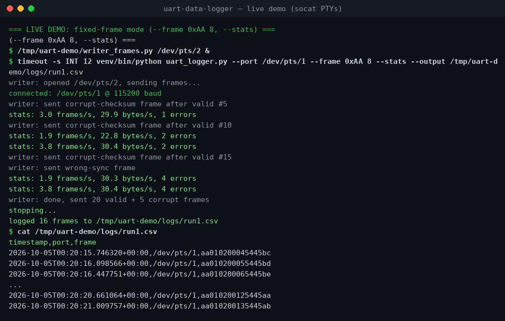

# uart-data-logger

[](LICENSE) [](uart_logger.py)

A small Python CLI tool that reads frames from a serial port, stamps each one with a UTC timestamp, and appends them to a CSV file. If the port drops or fails to open, it waits and reconnects automatically (configurable delay and retry limit). Ctrl-C stops logging cleanly.

Built for unattended logging from dev boards — I got tired of babysitting a terminal during long test runs, so this keeps going on its own when the USB adapter flakes out.

Two framing modes:

- **Line mode** (default): newline-terminated text frames.
- **Fixed-frame mode** (`--frame SYNC LEN`): fixed-length binary frames that must start with the sync byte `SYNC` and carry a valid trailing XOR checksum; anything else is dropped and counted as an error.

## Prerequisites

- Python 3.9+
- A serial port (USB-UART adapter, dev board, or a virtual port such as `socat`-created PTYs for testing)
- Install dependencies: `pip install -r requirements.txt`

## Usage

```sh
# basic: log /dev/ttyUSB0 at 115200 baud to uart_log.csv
python uart_logger.py --port /dev/ttyUSB0

# custom baud rate, output file, and reconnect behavior
python uart_logger.py --port /dev/ttyUSB0 --baud 9600 \
    --output logs/run1.csv --reconnect-delay 5 --max-retries 10

# live throughput stats on stderr (frames/s, bytes/s, error count)
python uart_logger.py --port /dev/ttyUSB0 --stats

# rotate to a new timestamped CSV file every 10 MB
python uart_logger.py --port /dev/ttyUSB0 --max-size 10485760

# fixed-frame mode: 8-byte frames, sync 0xAA, trailing XOR checksum
python uart_logger.py --port /dev/ttyUSB0 --frame 0xAA 8
```

CSV columns: `timestamp` (ISO-8601 UTC), `port`, `frame`. In fixed-frame mode
the `frame` column holds the hex-encoded frame bytes.

Rotated files are named by inserting a UTC timestamp before the extension:
`logs/run1.csv` → `logs/run1_20261002T080001.csv`, and each file carries its
own CSV header.

Example output:

```csv
timestamp,port,frame
2026-10-02T08:00:01.123456+00:00,/dev/ttyUSB0,temp=21.5
2026-10-02T08:00:02.031209+00:00,/dev/ttyUSB0,temp=21.6
```

## Screenshots

Live run over a virtual serial pair (`socat`-created PTYs): valid fixed frames
land in the CSV while corrupt ones are dropped and counted in the stats line.



## Tests

The test suite uses a fake serial port, so no hardware is needed:

```sh
python -m pytest tests/ -v
```

## Files

- `uart_logger.py` — the logger (argparse CLI, reconnect loop, CSV writer,
  `--stats` throughput reporting, `--max-size` log rotation, `--frame`
  checksum-validated fixed frames)
- `requirements.txt` — `pyserial`, `pytest`
- `tests/test_uart_logger.py` — tests with a `FakeSerial` stub covering
  logging, reconnects, retry limits, CLI defaults, stats, rotation, and
  fixed-frame validation

## License

MIT
